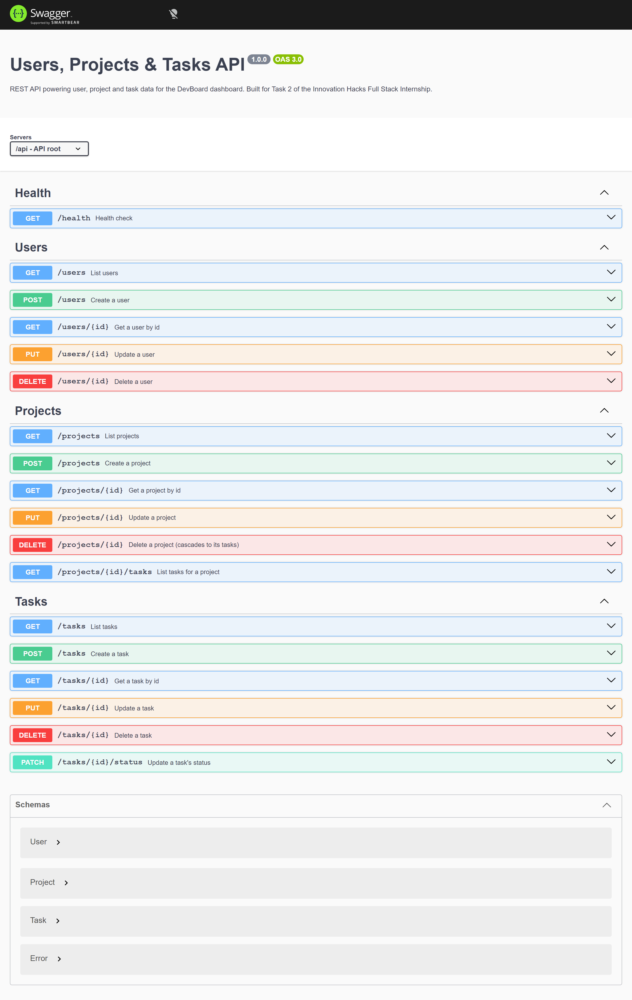
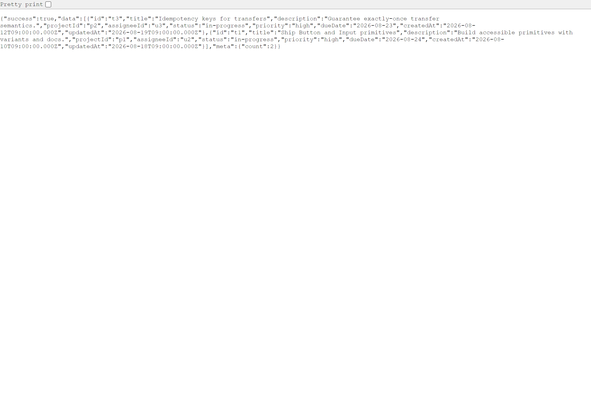

# Users, Projects & Tasks API

**Task 2 · Backend & REST API Development** — Innovation Hacks Full Stack Development Internship

A production-style **REST API** built with **Node.js, Express and TypeScript** that powers user, project, and task data — the backend behind the Task 1 dashboard and the Task 4 platform. It ships with input validation, centralized error handling, correct HTTP status codes, environment-based configuration, and **interactive OpenAPI (Swagger) docs**.

> Task 2 uses a swappable in-memory data store. Task 3 replaces that store with MongoDB without changing the routes, controllers, or validation.

---

## ✨ Features

- **Users** — full CRUD with unique-email enforcement.
- **Projects** — full CRUD, filtering (`status`, `search`), member validation, and cascade-delete of tasks.
- **Tasks** — full CRUD, filtering (`status`, `priority`, `projectId`, `assigneeId`, `search`), plus a dedicated **status-management** endpoint (`todo` / `in-progress` / `done`).
- **Referential integrity** — a task must reference a real project; assignees and project members must reference real users.
- **Input validation** on every write, using [Zod](https://zod.dev/); failures return `422` with a field-by-field breakdown.
- **Centralized error handling** — one handler turns every error into a consistent JSON envelope with the right status code.
- **Correct HTTP status codes** — `200 / 201 / 204 / 400 / 404 / 409 / 422 / 500`.
- **Security & platform middleware** — `helmet`, `cors`, `morgan`, graceful shutdown.
- **Config via environment variables**, validated at startup.
- **Docs** — interactive Swagger UI at `/api/docs`, raw spec at `/api/openapi.json`, plus a Postman collection.

---

## 🛠 Tech Stack

| Concern | Choice |
|---|---|
| Runtime | Node.js |
| Framework | Express 4 |
| Language | TypeScript |
| Validation | Zod |
| Docs | swagger-ui-express (OpenAPI 3.0) |
| Security | helmet, cors |
| Logging | morgan |

---

## 📸 Screenshots

| Interactive API docs (Swagger UI) | Example JSON response |
|---|---|
|  |  |

---

## 📚 API Reference

Base URL: `http://localhost:4000/api`

Every response uses a consistent envelope:

```jsonc
// success
{ "success": true, "data": { /* ... */ }, "meta": { "count": 4 } }
// error
{ "success": false, "error": { "message": "Validation failed", "details": [ /* ... */ ] } }
```

### Health
| Method | Path | Description |
|---|---|---|
| GET | `/api/health` | Liveness/health check |

### Users
| Method | Path | Description | Success |
|---|---|---|---|
| GET | `/api/users` | List users | 200 |
| GET | `/api/users/:id` | Get a user | 200 / 404 |
| POST | `/api/users` | Create a user | 201 / 409 / 422 |
| PUT | `/api/users/:id` | Update a user | 200 / 404 / 422 |
| DELETE | `/api/users/:id` | Delete a user | 204 / 404 |

### Projects
| Method | Path | Description | Success |
|---|---|---|---|
| GET | `/api/projects` | List projects (`?status=&search=`) | 200 |
| GET | `/api/projects/:id` | Get a project | 200 / 404 |
| GET | `/api/projects/:id/tasks` | List that project's tasks | 200 / 404 |
| POST | `/api/projects` | Create a project | 201 / 422 |
| PUT | `/api/projects/:id` | Update a project | 200 / 404 / 422 |
| DELETE | `/api/projects/:id` | Delete a project (cascades tasks) | 204 / 404 |

### Tasks
| Method | Path | Description | Success |
|---|---|---|---|
| GET | `/api/tasks` | List tasks (`?status=&priority=&projectId=&assigneeId=&search=`) | 200 |
| GET | `/api/tasks/:id` | Get a task | 200 / 404 |
| POST | `/api/tasks` | Create a task | 201 / 422 |
| PUT | `/api/tasks/:id` | Update a task | 200 / 404 / 422 |
| PATCH | `/api/tasks/:id/status` | **Update task status** | 200 / 404 / 422 |
| DELETE | `/api/tasks/:id` | Delete a task | 204 / 404 |

Full request/response schemas live in the interactive docs at **`/api/docs`**. A Postman collection is included: [`postman_collection.json`](postman_collection.json).

### Quick example

```bash
# Create a task
curl -X POST http://localhost:4000/api/tasks \
  -H "Content-Type: application/json" \
  -d '{"title":"Add rate limiting","projectId":"p2","assigneeId":"u3","priority":"high"}'

# Move it to done
curl -X PATCH http://localhost:4000/api/tasks/<id>/status \
  -H "Content-Type: application/json" -d '{"status":"done"}'
```

---

## 🚀 Getting Started

### Prerequisites
- Node.js 18+
- npm 9+

### Installation

```bash
# 1. Install dependencies
npm install

# 2. Create your env file
cp .env.example .env

# 3. Run in development (auto-reload)
npm run dev

# — or build & run for production —
npm run build
npm start
```

- API: [http://localhost:4000](http://localhost:4000)
- Docs: [http://localhost:4000/api/docs](http://localhost:4000/api/docs)

### Scripts
| Script | Description |
|---|---|
| `npm run dev` | Dev server with hot reload (tsx) |
| `npm run build` | Compile TypeScript to `dist/` |
| `npm start` | Run the compiled server |
| `npm run typecheck` | Type-check without emitting |

---

## 🔐 Environment Variables

See [`.env.example`](.env.example). Values are validated at startup — a bad value stops the server with a clear message.

| Variable | Default | Description |
|---|---|---|
| `PORT` | `4000` | Port to listen on |
| `NODE_ENV` | `development` | `development` \| `production` \| `test` |
| `CORS_ORIGIN` | `*` | Comma-separated allowed origins |

> **Never commit real secrets.** `.env` is git-ignored; only `.env.example` is tracked.

---

## ☁️ Deployment (Render)

This repo includes a [`render.yaml`](render.yaml) blueprint.

1. Push this repo to GitHub.
2. On [Render](https://render.com): **New → Blueprint**, connect the repo.
3. Render runs `npm install && npm run build`, then `npm start`. `PORT` is injected automatically.
4. Your live link will be `https://<service>.onrender.com` — the root and `/api/docs` are both browsable.

Also works on Railway (Node service: build `npm run build`, start `npm start`) or any Node host.

---

## 📁 Project Structure

```
task-2-rest-api/
├── src/
│   ├── server.ts              # Boots the HTTP server (+ graceful shutdown)
│   ├── app.ts                 # Express app: middleware, docs, routes, error handler
│   ├── routes.ts              # Combines feature routers under /api
│   ├── config/env.ts          # Loads + validates environment variables (Zod)
│   ├── docs/openapi.ts        # OpenAPI 3.0 spec (served via Swagger UI)
│   ├── lib/                   # ApiError, asyncHandler, response + id helpers
│   ├── middleware/            # validate, notFound, errorHandler
│   ├── store/                 # In-memory store + seed data (swapped for DB in Task 3)
│   ├── types.ts               # Shared domain types
│   └── modules/
│       ├── users/             # schema · service · controller · routes
│       ├── projects/          # schema · service · controller · routes
│       └── tasks/             # schema · service · controller · routes
├── postman_collection.json
├── render.yaml
└── .env.example
```

---

## ✅ Evaluation Mapping (Task 2)

| Requirement | Where it lives |
|---|---|
| User management endpoints | `src/modules/users/*` |
| Project creation & retrieval | `src/modules/projects/*` |
| Task creation, update, deletion | `src/modules/tasks/*` |
| Task status management | `PATCH /api/tasks/:id/status` |
| Centralized error handling | `src/middleware/errorHandler.ts` |
| Input validation on all writes | `src/middleware/validate.ts` + Zod schemas |
| Correct, meaningful status codes | `src/lib/http.ts`, `ApiError`, controllers |
| Environment variables for config/secrets | `src/config/env.ts`, `.env.example` |
| Clear API documentation | Swagger UI (`/api/docs`) + OpenAPI + Postman |

---

## 🎥 Demo

- **Demo video:** _add your 2–5 minute endpoint walkthrough link here_
- **Live deployment:** _add your Render/Railway link here_

---

## 📄 License

Built for the Innovation Hacks Full Stack Development Internship. Free to use for learning and evaluation.
